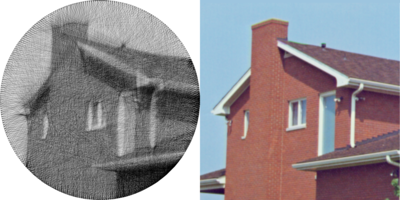
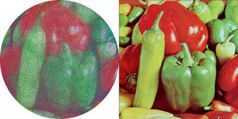

# String Art

A software simulation of [string art](https://www.youtube.com/watch?v=WGccIFf6MF8) that people make by winding a string around pegs nailed into a wooden board.

This program replicates photographs by drawing chords of a circle.

<video width="400" height="200" controls>
  <source src="./sample-images/face/face-comparison.mp4" type="video/mp4">
</video>





## How It Works

The program simulates placing `n` pegs in a circle on the image.
Starting with an arbitrary peg, the program iterates through all the possible pegs that it could draw a line to and picks the best one.
This process is repeated starting from the new peg, until a sufficient number of lines have been drawn.

## Dependencies
- `imagemagick 6.0 (q16hdri)` is needed for reading and writing images
- `ffmpeg` (optional) is needed to make a video of the string art generation

This program supports all the image formats that your `imagemagick` installation does.

## Build and Run
```
make
./string-art [options ...] input-image-file
```
For example,
```
./string-art -p 300 -l 10000 --stop-early -o output-string-art.png input-image.png 
```
See the Options section below for details.

## Options
```
--output, -o,             set the output filename (default "string-art.png")
--num-pegs, -p,           set the number of pegs around the circle (default 200)
--num-lines, -l,          set the number of lines to be drawn (default 10,000)
--string-color, -s,       set the color of the lines used to draw the image (default black)
--background-color, -b,   set the background color (default white)
--video, -v,              output a video of the drawing process (default false)
--rgb, -rgb,              use red, green, and blue strings to generate a color image (default false)
--stop-early, -stop,      stop the generation after 1000 lines with no improvement (default false)
--line-weight, -lw,       set how dark the program thinks the virtual lines are (0-255) (default 20)
--string-weight, -sw,     set how dark the program thinks the string is (0-255) (default 20)
--min-arc, -m,            set the minimum arc that chords must subtend, in degrees (default 0)
--help, -h,               display this help and exit
```

### Making a video
Due to a limitation of the x264 codec, when using the `--video` option the input image must have even width and height.

### Making the image lighter or darker
The `--line-weight` and `--string-weight` options can be adjusted to produce a darker or lighter image.
The `--string-weight` option determines how dark a single thread of string should appear in the final image.
The `--line-weight` option determines how dark a single thread of string should be when generating the image.
That is, `--line-weight` is used to determine the best possible line to draw at each iteration, but `--string-weight` is the darkness of the line that is drawn to the image.
So, if the ratio of `--line-weight` to `--string-weight` is greater than 1, the generation process will think the string is darker than it actually appears in the image. 
So, the final image will turn out fainter than the input image.
Similarly, if the ratio is less than 1, the final image will be darker.